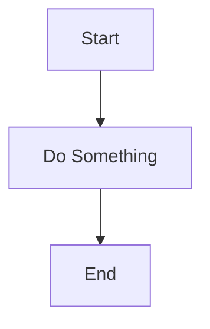

# Design Documentation

This directory contains comprehensive documentation about the design, architecture, and decision-making process for the Yahoo Fantasy Sports API wrapper.

## Purpose

The design documentation serves several key purposes:

1. **Preserve Decision Context** - Understand WHY decisions were made, not just what was decided
2. **Enable Future Contributors** - Onboard new developers quickly with clear architectural understanding
3. **Track Evolution** - See how the design has changed over time and why
4. **Facilitate Discussion** - Provide a structured way to propose and evaluate changes
5. **Document Complexity** - Capture the nuances of working with Yahoo's API

## Directory Structure

### `/decisions/` - Architecture Decision Records (ADRs)

Architecture Decision Records follow a standard format to document significant architectural decisions. Each ADR includes:
- Context (the problem we're solving)
- Decision (what we chose to do)
- Consequences (trade-offs and implications)
- Alternatives considered

**Current ADRs:**
- [001 - TypeScript Over JavaScript](decisions/001-typescript-over-javascript.md)
- [002 - Resource-Based API Design](decisions/002-resource-based-api-design.md)
- [003 - XML Parsing Strategy](decisions/003-xml-parsing-strategy.md)
- [004 - OAuth Implementation](decisions/004-oauth-implementation.md)
- [005 - Error Handling Approach](decisions/005-error-handling-approach.md)
- [006 - Type System Philosophy](decisions/006-type-system-philosophy.md)
- [007 - NHL-First Development](decisions/007-nhl-first-development.md)
- [008 - Bun as Runtime](decisions/008-bun-as-runtime.md)

### `/plans/` - Planning Documents

Strategic planning documents that outline implementation roadmaps and coverage tracking:

- **[initial-plan.md](plans/initial-plan.md)** - The comprehensive implementation plan
- **[api-coverage-matrix.md](plans/api-coverage-matrix.md)** - Tracks which API features are implemented
- **[type-coverage-plan.md](plans/type-coverage-plan.md)** - Type system implementation roadmap
- **[testing-strategy.md](plans/testing-strategy.md)** - Testing approach and goals
- **[release-roadmap.md](plans/release-roadmap.md)** - Version milestones and release planning

### `/research/` - Research & Analysis

Background research and analysis that informed design decisions:

- **[yahoo-api-analysis.md](research/yahoo-api-analysis.md)** - Deep dive into Yahoo's API structure and quirks
- **[competitor-analysis.md](research/competitor-analysis.md)** - Analysis of other Yahoo Fantasy wrappers
- **[oauth-flows.md](research/oauth-flows.md)** - OAuth 2.0 implementation research
- **[xml-vs-json.md](research/xml-vs-json.md)** - API format considerations

### `/diagrams/` - Visual Documentation

Mermaid diagrams illustrating architecture and flows:

- **[architecture-overview.mmd](diagrams/architecture-overview.mmd)** - High-level system architecture
- **[oauth-flow.mmd](diagrams/oauth-flow.mmd)** - OAuth authentication flow
- **[resource-relationships.mmd](diagrams/resource-relationships.mmd)** - How resources relate to each other
- **[type-hierarchy.mmd](diagrams/type-hierarchy.mmd)** - Type inheritance structure

### `/api-mappings/` - Yahoo API Mappings

Detailed mappings between Yahoo's API and our wrapper API:

- **[game-resource.md](api-mappings/game-resource.md)** - Game resource mapping
- **[league-resource.md](api-mappings/league-resource.md)** - League resource mapping
- **[team-resource.md](api-mappings/team-resource.md)** - Team resource mapping
- **[player-resource.md](api-mappings/player-resource.md)** - Player resource mapping
- **[transaction-resource.md](api-mappings/transaction-resource.md)** - Transaction resource mapping
- **[roster-resource.md](api-mappings/roster-resource.md)** - Roster resource mapping

## How to Contribute

### Proposing a New Decision

When you need to make a significant architectural decision:

1. Copy `decisions/template.md` to a new file with the next number
2. Fill in all sections of the ADR
3. Discuss with team/maintainers
4. Update status to "Accepted" when finalized
5. Update `CHANGELOG.md` with the decision

### Updating Plans

As implementation progresses:

1. Update coverage matrices with current status
2. Keep roadmap realistic with actual progress
3. Document any deviations from the plan
4. Add lessons learned to relevant research docs

### Creating Diagrams

Use Mermaid syntax for diagrams so they render on GitHub:

## Maintenance

This documentation should be:
- **Updated regularly** as the project evolves
- **Referenced in PRs** when making architectural changes
- **Kept accurate** - outdated docs are worse than no docs
- **Accessible** - written for future developers who weren't here for the original discussions

## Questions?

If you have questions about the design or need clarification on any decisions, please:
1. Check the relevant ADR first
2. Review related planning documents
3. Open a GitHub issue for discussion
4. Propose a new ADR if needed

---

*Last Updated: 2024-11-15*
