# Validated API Path Tree

This diagram summarizes the Yahoo Fantasy API path surface that currently has positive live-validation evidence.

Interpretation:

- Solid edges: direct live request passed on the original path shape.
- Dashed edges: the original path needed `league_keys`, and the path family validated only after injecting that parameter.
- Blue nodes: resource roots or resource-shaped nodes.
- Green nodes: collection roots or collection-shaped nodes.
- Amber nodes: other validated path nodes such as subresources, expansions, or filtered child paths.
- Omitted from the tree: paths still marked provisional or demoted in [CURRENT_FINDINGS.md](CURRENT_FINDINGS.md) and [actionable-route-report.md](actionable-route-report.md).

```mermaid
flowchart LR
    root["Validated Yahoo Fantasy API Paths"]

    root --> users["users;use_login=1"]
    users --> users_games["games"]
    users --> users_teams["teams"]
    users_games --> users_games_leagues["leagues"]
    users_games --> users_games_teams["teams"]
    users_games_leagues --> users_games_leagues_settings["settings"]
    users_games_leagues --> users_games_leagues_teams["teams"]
    users_games_leagues --> users_games_leagues_players["players"]
    users_games_teams --> users_games_teams_roster["roster"]

    root --> game["game/{game_key}\nvalidated as /game/465 and /game/nhl"]
    game --> game_players["players"]
    game --> game_weeks["game_weeks"]
    game -. "league_keys reprobe passed" .-> game_leagues["leagues"]
    game_leagues -.-> game_leagues_teams["teams"]
    game_leagues -.-> game_leagues_players["players"]
    game_leagues -.-> game_leagues_transactions["transactions"]

    root --> games["games\nvalidated collection forms include is_available, game_codes+seasons, and game_keys+players"]
    games --> games_metadata["metadata"]
    games --> games_players["players"]
    games -. "league_keys reprobe passed" .-> games_leagues["leagues"]
    games_leagues -.-> games_leagues_teams["teams"]

    root --> league["league/{league_key}"]
    league --> league_settings["settings"]
    league --> league_standings["standings"]
    league --> league_scoreboard["scoreboard"]
    league --> league_teams["teams"]
    league --> league_players["players"]
    league --> league_transactions["transactions"]
    league_teams --> league_teams_roster["roster (with team_keys)"]
    league_teams_roster --> league_teams_roster_players["players"]
    league_players --> league_players_stats["stats (with player_keys)"]
    league_players --> league_players_ownership["ownership (with player_keys)"]
    league_players --> league_players_percent_owned["percent_owned (with player_keys)"]

    root --> leagues["leagues;league_keys={...}"]
    leagues --> leagues_settings["settings"]
    leagues --> leagues_standings["standings"]
    leagues --> leagues_scoreboard["scoreboard"]
    leagues --> leagues_teams["teams"]
    leagues --> leagues_players["players"]
    leagues --> leagues_transactions["transactions"]
    leagues_teams --> leagues_teams_roster["roster"]
    leagues_teams_roster --> leagues_teams_roster_players["players"]

    root --> team["team/{team_key}"]
    team --> team_roster["roster"]
    team --> team_matchups["matchups"]
    team --> team_stats["stats"]
    team_roster --> team_roster_players["players"]

    root --> teams["teams;team_keys={...}"]
    teams --> teams_roster["roster"]
    teams --> teams_matchups["matchups"]
    teams --> teams_stats["stats"]
    teams_roster --> teams_roster_players["players"]

    root --> player["player/{player_key}"]
    player --> player_stats["stats"]
    player --> player_ownership["ownership"]
    player --> player_percent_owned["percent_owned"]

    root --> players["players;player_keys={...}"]
    players --> players_stats["stats"]
    players --> players_ownership["ownership"]
    players --> players_percent_owned["percent_owned"]

    classDef root fill:#0f172a,stroke:#0f172a,color:#ffffff;
    classDef resource fill:#dbeafe,stroke:#1d4ed8,color:#0b1f4d;
    classDef collection fill:#dcfce7,stroke:#15803d,color:#052e16;
    classDef path fill:#fef3c7,stroke:#b45309,color:#451a03;

    class root root;
    class game,league,team,player resource;
    class users,users_games,users_teams,users_games_leagues,users_games_teams,game_leagues,games,games_leagues,league_teams,league_players,league_transactions,leagues,leagues_teams,leagues_players,leagues_transactions,teams,players,users_games_leagues_teams,users_games_leagues_players,game_leagues_teams,game_leagues_players,game_leagues_transactions,games_players,games_leagues_teams,league_teams_roster,league_teams_roster_players,leagues_teams_roster,leagues_teams_roster_players,team_roster_players,teams_roster,teams_roster_players collection;
    class users_games_leagues_settings,users_games_teams_roster,game_players,game_weeks,games_metadata,league_settings,league_standings,league_scoreboard,league_players_stats,league_players_ownership,league_players_percent_owned,leagues_settings,leagues_standings,leagues_scoreboard,team_roster,team_matchups,team_stats,teams_matchups,teams_stats,teams_roster_players,player_stats,player_ownership,player_percent_owned,players_stats,players_ownership,players_percent_owned path;
```

## Excluded From The Tree

Not shown here:

- Confident demotion candidates: `/users;use_login=1/leagues`, `/users;use_login=1;out=leagues`
- Provisional `games ... out=leagues ...` routes that still fail even after `league_keys` injection and parameter-order retries
- Public `games ... /leagues/players` and `games ... /leagues/transactions` variants that still fail after `league_keys` reprobe
- Transaction-root paths such as `/transaction/{transaction_key}` because the current concrete transaction keys do not validate