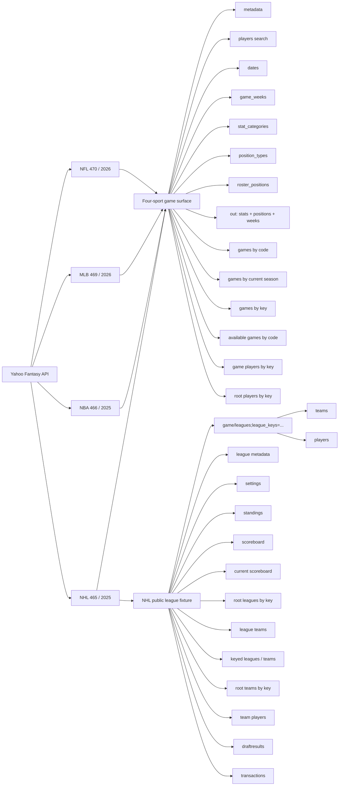

# Validated API Path Tree

This tree shows current positive evidence from the 2026-07-15 cross-sport run. A four-sport edge passed for NFL, MLB, NBA, and NHL with parser-shape checks where defined. NHL-only league edges use a configured public fixture and must not be generalized to other sports.

## Coverage Interpretation

- The common game surface has direct evidence in every supported draft-and-trade sport.
- `game_weeks` exists in all four sports, even though roster/stat coverage is weekly for NFL and date-based for MLB/NBA/NHL.
- League and deeper resource evidence is currently complete only for the configured NHL public fixture.
- Private historical evidence from the May 2026 NHL-only verifier remains useful context, but it is not represented as current cross-sport proof here.
- See [actionable-route-report.md](actionable-route-report.md) for sanitized paths, facts, and statuses. Detailed response artifacts remain in ignored local `tmp/` storage.
